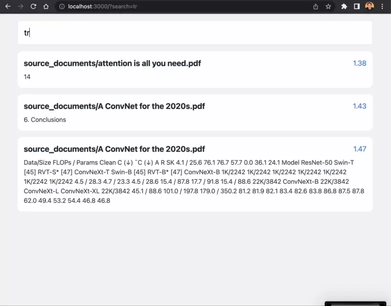

## Overview

I really enjoy using [privateGPT](https://github.com/imartinez/privateGPT) and ask questions to all my documents. It would be nice if it had:

- a proper frontend, so I don't have to enter my questions into terminal,
- ability to have a quick simple semantic search (if I don't want to wait LLM response).

This is a simple experimental frontend which allows me to interact with privateGPT from the browser.

Note: for now it has only semantic serch. Q/A feature would be next.



Note: blue numer is a `cos` distance between embedding vectors. The smaller the number, the more close these sentences.

## Getting Started

### Setting up privateGPT

1. Install [privateGPT](https://github.com/imartinez/privateGPT) (follow their instructions).
2. Update `requirements.txt` in the `privateGPT` folder to have:

```
chromadb==0.3.29
flask==2.3.2
flask_cors==3.0.10
pydantic==1.10.11
```

3. Run `pip3 install -r requirements.txt` in your `privateGPT` folder.

4. Run flask backend with `python3 privateGptServer.py`.

### Setting up frontend

4. clone this repo with (or download zip archive and extract it):

```bash
git clone https://github.com/nozdrenkov/private-gpt-frontend.git
```

5. In the `private-gpt-frontend` install all dependencies:

```bash
npm install
```

6. Run the frontend with (in the same `private-gpt-frontend` folder):

```bash
npm run dev
```

7. Open http://localhost:3000 in the browser and start searching!

8. You can also put your search term in ther URL http://localhost:3000/?search=your%20question (this way you can setup automation with [Chrome search engine](https://support.google.com/chrome/answer/95426) or using [Alfred](https://www.alfredapp.com/)).
